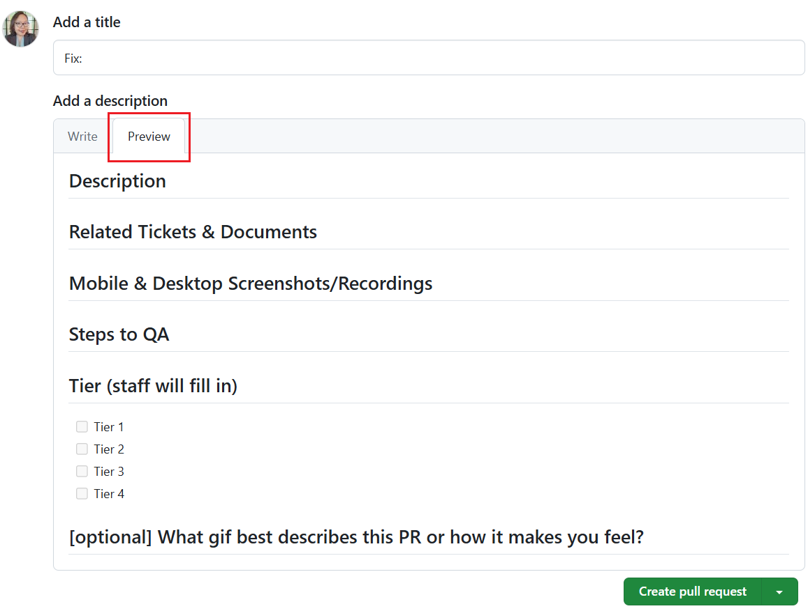
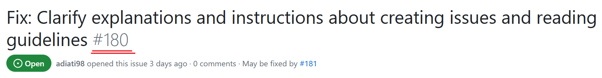
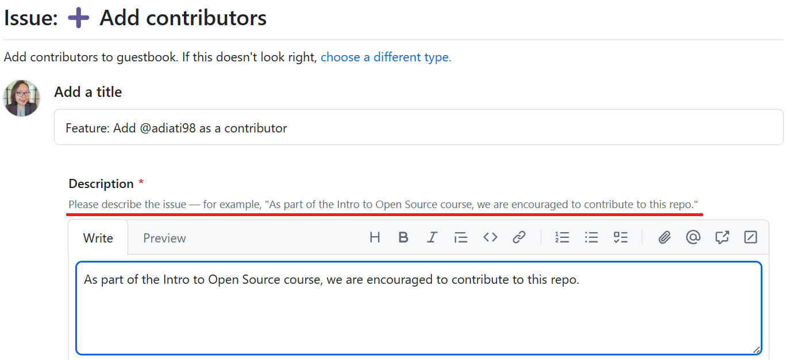

# Cómo contribuir al Open Source

En este capítulo, lo guiaremos a través del proceso de contribución a proyectos Open Source.

## Encontrar proyectos en los que trabajar

Uno de los primeros desafíos que puede enfrentar al comenzar con el Open Source es encontrar un proyecto en el que contribuir. A continuación se ofrecen algunos consejos que le ayudarán a descubrir proyectos que se alineen con sus intereses y habilidades:

1. **Explore GitHub y GitLab**: Tanto GitHub como GitLab albergan una gran cantidad de proyectos Open Source. Puede utilizar su función de búsqueda para encontrar proyectos basados ​​en palabras clave, lenguajes de programación o temas específicos.

2. **Siga sus intereses**: piense en las herramientas, marcos de trabajo y bibliotecas que utilizas o sobre las que te interesa aprender un poco más. Muchos de estos proyectos son Open Source y agradecen las contribuciones de la comunidad.

3. **Únase a comunidades Open Source**: existen numerosas comunidades, foros y plataformas de chat en línea dedicados al desarrollo Open Source. Al unirte a estas comunidades, puedes conectarte con otros desarrolladores, descubrir nuevos proyectos y encontrar oportunidades de colaboración. En el [Discord de OpenSauced ](https://discord.com/invite/U2peSNf23P), por ejemplo, compartimos "buenos primeros problemas", proyectos interesantes de GitHub y problemas que tenemos abiertos en nuestros repositorios.

4. **Aproveche OpenSauced**: [OpenSauced](https://opensauced.pizza/) es una plataforma que ayuda a los desarrolladores a descubrir y contribuir a proyectos Open Source. Al utilizar OpenSauced, puede encontrar proyectos que se alineen con sus intereses, habilidades y objetivos.

### Descubriendo el Open Source con OpenSauced

OpenSauced es una poderosa herramienta para encontrar proyectos Open Source en los que contribuir. Para comenzar con OpenSauced, siga estos pasos:

1. **Regístrese para obtener una cuenta**: visite https://www.opensauced.pizza/ y regístrese para obtener una cuenta utilizando sus credenciales de GitHub.

   

   Durante el proceso de registro, se le pedirá que elija algunos intereses y establezca su zona horaria. Esto ayudará a OpenSauced a recomendar proyectos que se ajusten a sus intereses y cronograma.

2. **Explore el panel**: una vez que se haya registrado, accederá a su panel, donde podrá ver sus proyectos, objetivos y contribuciones actuales. Al hacer clic en "Explorar" en el encabezado, podrá buscar proyectos según sus intereses y habilidades.

3. **Buscar proyectos**: en Explorar, puede ver una lista de repositorios y sus niveles de actividad relevantes y niveles de participación que son tendencia actualmente. También puedes buscar proyectos escribiendo en la barra de búsqueda. Puede buscar proyectos por nombre, descripción o tema y utilizar esta herramienta para encontrar algo que le interese.

   

4. **Guarde proyectos en sus páginas de Insights**: cuando encuentre proyectos que le interesen, puede agregarlos a las páginas de "Insights" que le brindan más detalles sobre la actividad de los proyectos. O, si prefieres simplemente sumergirte y contribuir, puedes pasar al siguiente paso.

5. **Empieza a contribuir**: cuando haces clic en el nombre de un repositorio, accederás a su página de GitHub, donde podrás explorar temas que están abiertos y listos para contribuir, sabiendo que la comunidad que rodea este proyecto está activo y sus contribuciones serán bienvenidas.

Al utilizar OpenSauced, puede agilizar el proceso de búsqueda de proyectos Open Source en los que trabajar y concentrarse en contribuir a los proyectos que se alinean con sus intereses y objetivos.

## Incorporación en un nuevo proyecto

Cuando esté interesado en contribuir a un nuevo proyecto Open Source, es importante familiarizarse con las pautas, convenciones y flujo de trabajo del proyecto y tomar la iniciativa de incorporarse.

A continuación se ofrecen algunos consejos que le ayudarán a incorporarse con éxito:

1. **Lea la documentación del proyecto**: lea el archivo README, las pautas de contribución y el código de conducta para familiarizarse con el proyecto. Le ayudarán a comprender los objetivos, requisitos y expectativas del proyecto para los contribuyentes.

2. **Empiece poco a poco**: cuando es nuevo en un proyecto, es una buena idea comenzar con tareas pequeñas y manejables, como corregir errores, agregar pruebas o actualizar documentación. Esto le ayudará a familiarizarse con la base del código y el flujo de trabajo de desarrollo sin sentirse abrumado.

3. **Únase a la comunidad**: muchos proyectos Open Source tienen comunidades, foros o plataformas de chat en línea donde los desarrolladores pueden hacer preguntas, compartir conocimientos y colaborar. Al unirse a estas comunidades, puede conectarse con otros contribuyentes, aprender de sus experiencias y obtener ayuda con cualquier problema que encuentre.

4. **Pide ayuda**: Si necesitas una aclaración o encuentras algún problema, no dudes en pedir ayuda. Las comunidades Open Source generalmente son solidarias y acogedoras; Otros contribuyentes estarán encantados de ayudarle.

5. **Sea paciente y persistente**: incorporarse a un nuevo proyecto puede ser un desafío, especialmente si es nuevo en el desarrollo Open Source. Sea paciente y no se desanime ante los obstáculos o errores. Te sentirás más cómodo y seguro en tus contribuciones con perseverancia y práctica.

## Comenzando a contribuir

Entonces, te has incorporado al proyecto. Ahora puedes prepararte para contribuir siguiendo estos pasos:

### 1. Lea la documentación

Tocamos esto brevemente en la sección anterior. Pero vale la pena volver a visitarlo porque es importante leer detenidamente la documentación del proyecto antes de comenzar a contribuir.

Comience leyendo el README y familiarizándose con el proyecto. Un README contiene una introducción al proyecto, como cómo funciona, su propósito, el stack tecnologíco que utiliza y cómo configurar y ejecutar el entorno local.

Una vez que esté familiarizado con el proyecto y esté interesado en contribuir, no se lance sin leer las pautas de contribución. Estas pautas se encuentran en el archivo CONTRIBUTING en la raíz del proyecto. Si el archivo no está disponible, puede encontrarlo en el archivo README.

Cada proyecto tiene diferentes reglas de contribución. Estas reglas están escritas en las pautas de contribución, que contienen información sobre cómo reclamar y trabajar con problemas, crear solicitudes de extracción y métodos de comunicación preferibles. Por ejemplo, puede consultar las [Pautas de contribución de OpenSauced](https://docs.opensauced.pizza/contributing/introduction-to-contributing/).

Algunos proyectos también tienen convenciones, como código y estilo Markdown, cómo escribir mensajes de confirmación, solicitudes de extracción y títulos de problemas, etc. Puede encontrarlos en su guía de estilo o en sus pautas de contribución.

?> Lea atentamente las pautas de contribución para comprender cómo el proyecto recibe contribuciones. Seguir estas pautas hará que su proceso de contribución sea más sencillo.

### 2. Buscar o crear un problema

Después de leer la documentación, puede comenzar a buscar problemas etiquetados como "buen primer problema" o "apto para principiantes" que sean adecuados para su nivel de habilidad. Al elegir en qué problema trabajar, considere sus intereses, nivel de habilidad y tiempo disponible.

Los problemas pueden verse como propuestas de cambios. Supongamos que desea informar un error o tiene ideas para una característica o mejora del proyecto o su documentación y desea proponerlas. En ese caso, puedes crear un problema para proponer tu intención. Lea [esta publicación de blog](https://dev.to/opensauced/streamline-your-contributions-mastering-issue-forms-and-pr-templates-36j5) para aprender cómo completar formularios de incidencias.

En open source, es crucial acompañar una solicitud de extracción con un problema por varias razones:

- **Contexto y discusión**: Dar contexto a su propuesta y discutirla con los mantenedores puede ayudar a garantizar que el cambio propuesto esté alineado con los objetivos, la arquitectura y la hoja de ruta del proyecto. Esta discusión ayuda a establecer expectativas claras y aumenta las posibilidades de que se acepte su solicitud de extracción.

- **Documentación y Seguimiento**: Los problemas actúan como una forma de documentación, proporcionando un registro histórico del problema identificado, la solución propuesta y el proceso de toma de decisiones detrás del cambio. Ayudan a los mantenedores a seguir el progreso del proyecto y priorizar las tareas. Al mismo tiempo, también permiten que otros contribuyentes comprendan el contexto y las razones detrás de los cambios introducidos en la solicitud de extracción.

- **Disminuir la comunicación bidireccional**: Discutir y acordar los cambios propuestos con anticipación a través del problema puede reducir la comunicación bidireccional durante el proceso de revisión de la solicitud de extracción. Esto puede ahorrarle tiempo a usted y a los mantenedores.

- **Evitar el trabajo innecesario**: La creación de un problema permite a los mantenedores brindar comentarios tempranos sobre el cambio propuesto. Pueden avisarte si existe un problema similar, si el cambio propuesto se alinea con los objetivos del proyecto o si existen métodos alternativos que sean más convenientes. Esto le ayuda a evitar perder tiempo y esfuerzo trabajando en algo que tal vez no sea aceptado porque entra en conflicto con los planes existentes.

- **Evitar solicitudes de extracción de spam**: Las solicitudes de extracción no solicitadas (solicitudes de extracción sin problemas) y no deseadas pueden marcarse como spam porque se considera que introducen cambios irrelevantes, de baja calidad o dañinos en el código base del proyecto. Marcar su solicitud de extracción como spam puede provocar rechazo, pérdida de oportunidades de contribución y potencialmente dañar su reputación.

### 3. Solicitar que se te asigne un problema

Ciertos proyectos pueden tener reglas específicas con respecto a la asignación de problemas. Es posible que algunos proyectos requieran que solicites permiso antes de trabajar en un problema, mientras que otros te permiten asignarte un problema. Es por eso que revisar las pautas de contribución del proyecto es esencial para saber cómo reclamar problemas.

Si las pautas de contribución no indican cómo reclamar un problema, puede pedirles a los mantenedores que se lo asignen. Esto asegurará que no haya duplicaciones y que su contribución esté alineada con los objetivos y requisitos del proyecto.

Puede dejar un comentario sobre el problema, como "¿Me pueden asignar este problema?" Cuando el mantenedor te lo haya asignado, notarás que tu nombre de usuario ahora se encuentra en la sección "Asignados".


## Flujo de trabajo de contribución

Una vez que un mantenedor le haya asignado un problema, el siguiente paso es trabajar en los cambios. Aquí hay un flujo de trabajo general del proceso:

### 1. Bifurcar el repositorio

[Bifurcar un repositorio](https://docs.github.com/en/get-started/quickstart/fork-a-repo#forking-a-repository) significa crear una copia del repositorio en su cuenta de GitHub. Le permite enviar cambios al código base remoto sin afectar el proyecto original.

### 2. Clonar el repositorio bifurcado

[Clonar su repositorio bifurcado](https://docs.github.com/en/repositories/creating-and-managing-repositories/cloning-a-repository#cloning-a-repository) significa hacer una copia de su repositorio bifurcado en su máquina local. Ejecute el siguiente comando en su terminal:

   ```
   git clone https://github.com/TU-USUARIO/NOMBRE-DEL-REPOSITORIO.git
   ```

   Reemplace "TU-USUARIO" con su nombre de usuario de GitHub y "NOMBRE-DEL-REPOSITORIO" con el nombre del repositorio.

### 3. Crea una nueva rama

Antes de realizar cualquier cambio, cree una nueva rama en su repositorio local para trabajar en su contribución. Crear una nueva rama es la mejor práctica en Open Source porque mantiene los cambios separados de la rama `main`.

   Puede crear una nueva rama usando el siguiente comando:

   ```
   git checkout -b NOMBRE-DE-SU-RAMA
   ```

   Reemplace "NOMBRE-DE-SU-RAMA" con un nombre descriptivo para su rama, como "fix-bug-123" o "agregar-nueva-función".

### 4. Haga sus cambios

Ahora que tiene una nueva rama, puede realizar cambios en el código base. Siga siempre las pautas y convenciones de codificación del proyecto.

### 5. Ejecute los cambios localmente

Siempre debes ejecutar y verificar tus cambios en tu entorno local, sin importar cuán pequeños sean. Esto es importante para garantizar que funcionen como se espera y no rompan producción.

Puedes encontrar las instrucciones sobre cómo ejecutar un proyecto localmente en el archivo README o en las pautas de contribución.

### 6. Agregue y confirme los cambios

Una vez que haya realizado los cambios, agréguelos al área de preparación y confírmelos con estos comandos:

   ```
   git add .
   git commit -m "Tu mensaje de confirmación"
   ```

   Reemplace `"Tu mensaje de confirmación"` con una breve descripción de sus cambios.

### 7. Envíe sus cambios

Envíe sus cambios a su repositorio bifurcado en GitHub ejecutando el siguiente comando:

   ```
   git push origin NOMBRE-DE-SU-RAMA
   ```

   Reemplace `"NOMBRE-DE-SU-RAMA"` con el nombre de su rama.

### 8. Trabajando con una solicitud de extracción

#### Cree una solicitud de extracción

Una vez que haya enviado sus cambios, ahora puede crear una [solicitud de extracción](https://docs.github.com/en/pull-requests/collaborating-with-pull-requests/proposing-changes-to-your-work-with-pull-requests/creating-a-pull-request-from-a-fork). Para crear una solicitud de extracción:

1. Navegue hasta el repositorio del proyecto original en GitHub.
2. Haga clic en el botón "Comparar y solicitar extracción".
3. Complete toda la información requerida en la plantilla.
4. Haga clic en el botón "Crear solicitud de extracción".

#### Complete una plantilla de solicitud de extracción

Puede resultar complicado leer y completar una plantilla de solicitud de extracción. A continuación se ofrecen algunos consejos sobre cómo llenar uno:

1. **Modo de vista previa**

    Haga clic en la pestaña "Vista previa" para ver las secciones que debe completar antes de hacerlo. Le resultará más fácil notarlos en este modo, pero tenga en cuenta que no puede editarlos en el modo de vista previa.

    A continuación se muestra un ejemplo de una plantilla de solicitud de extracción en OpenSauced en modo de vista previa:

    

2. **Encabezados**

    Vuelva al modo de escritura haciendo clic en la pestaña "Escribir". Preste atención a los títulos con el símbolo #. Debe proporcionar información justo debajo de estos títulos.

3. **Comentarios**

    Las instrucciones sobre qué información debe proporcionar generalmente están escritas en los comentarios debajo de cada encabezado. Debe leer y seguir todas las instrucciones minuciosamente.

    ?> **Consejo:** Al completar la información, escríbela debajo del comentario para que aún puedas ver y seguir las instrucciones.

    Aquí está la plantilla en Markdown. Ahora, preste atención a los títulos y comentarios que comentamos:

    ```markdown
    ## Description

    <!--
    Please do not leave this blank
    This PR [adds/removes/fixes/replaces] the [feature/bug/etc].
    -->

    ## Related Tickets & Documents

    <!--
    Please use this format link issue numbers: Fixes #123
    https://docs.github.com/en/free-pro-team@latest/github/managing-your-work-on-github/linking-a-pull-request-to-an-issue#linking-a-pull-request-to-an-issue-using-a-keyword
    -->

    ## Mobile & Desktop Screenshots/Recordings

    <!-- Visual changes require screenshots -->

    ## Steps to QA

    <!--
    Please provide some steps for the reviewer to test your change. If   you have wrote tests, you can mention that here instead.

    1. Click a link
    2. Do this thing
    3. Validate you see the thing working
    -->

    ## Tier (staff will fill in)

    - [ ] Tier 1
    - [ ] Tier 2
    - [ ] Tier 3
    - [ ] Tier 4

    ## [optional] What gif best describes this PR or how it makes you feel?

    <!-- note: PRs with deleted sections will be marked invalid -->

    <!--
    For Work In Progress Pull Requests, please use the Draft PR feature,
    see https://github.blog/2019-02-14-introducing-draft-pull-requests/ for further details.

    For a timely review/response, please avoid force-pushing additional
    commits if your PR already received reviews or comments.

    Before submitting a Pull Request, please ensure you've done the following:
    - 📖 Read the Open Sauced Contributing Guide: https://github.com/open-sauced/.github/blob/main/CONTRIBUTING.md.
    - 📖 Read the Open Sauced Code of Conduct: https://github.com/open-sauced/.github/blob/main/CODE_OF_CONDUCT.md.
    - 👷‍♀️ Create small PRs. In most cases, this will be possible.
    - ✅ Provide tests for your changes.
    - 📝 Use descriptive commit messages.
    - 📗 Update any related documentation and include any relevant screenshots.
    -->
    ```

4. **No omita ni elimine nada en la plantilla.**

    Lo importante es que debe completar cada sección de la plantilla que no diga "opcional" o que no deba completarla el equipo central o el personal. Además, nunca debe eliminar ni modificar la plantilla, incluso si Piensa que una sección no se aplica a tu contribución.

    Si una sección es irrelevante para sus cambios, deje un comentario explicando por qué es irrelevante o proporcione una breve respuesta "N/A". Si aún necesita ayuda con qué completar, mire las solicitudes de extracción anteriores y vea cómo otros contribuyentes lo han hecho.

##### Información requerida para proporcionar en la mayoría de las plantillas de solicitud de extracción

Cada proyecto es único. Cada uno tiene su propia estructura de plantilla de solicitud de extracción y requiere que se proporcione información específica. Sin embargo, todos los proyectos normalmente requieren lo siguiente:

- **Título**

    Agregue un título breve y claro que describa el cambio que realiza. Por ejemplo, "Fix: Color contrast in the landing page".

- **Descripción**

    Explique sus cambios con el mayor detalle posible. ¿Qué arreglaste? ¿Cómo lo arreglaste? ¿Agregaste una nueva función o modificaste una función? Si hay varios cambios, considere utilizar viñetas y proporcionar enlaces a los recursos que utiliza para realizar copias de seguridad de sus cambios.

    Aquí hay un ejemplo:

    ```markdown
    ## Description

    <!--
    Please do not leave this blank
    This PR [adds/removes/fixes/replaces] the [feature/bug/etc].
    -->

    This PR fixes the long repos' names that are partially stacked at the back of another name in the search input of the Explore tab.

    The changes made here:

    - Add Tailwind className:

    - [`truncate`](https://tailwindcss.com/docs/text-overflow#truncate) to truncate overflowing text.
    - [`tracking-tighter`](https://tailwindcss.com/docs/letter-spacing) to reduce letter spacing for better space.
    - `inline-block` to the `<span>` .

    - Remove Tailwind classNames:

    - `overflow-hidden` as it's [included in the `truncate`](https://tailwindcss.com/docs/text-overflow).
    - `break-all` as we don't want to add line breaks.
    ```

- **Problema(s) relacionados**

    La mayoría de los proyectos no reciben solicitudes de extracción no solicitadas (solicitudes de extracción que no van acompañadas de un problema). Una razón es evitar solicitudes de extracción no deseadas que podrían introducir cambios irrelevantes, de baja calidad o dañinos en el código base del proyecto.

    Entonces, cuando crea una solicitud de extracción, desea incluir el número de problema relacionado. Añade la palabra clave "Closes," "Fixes," o "Resolves" delante del número del problema, por ejemplo, "Closes #123".

    [Vincular una solicitud de extracción a un problema](https://docs.github.com/en/issues/tracking-your-work-with-issues/linking-a-pull-request-to-an-issue) cerrará automáticamente el problema una vez que la solicitud de extracción se fusione.

    Puedes encontrar el número del problema justo después del título, como se muestra a continuación.

    

    !>  Agregue aquí solo la [palabra clave admitida](https://docs.github.com/en/free-pro-team@latest/github/managing-your-work-on-github/linking-a-pull-request-to-an-issue#linking-a-pull-request-to-an-issue-using-a-keyword) y el número de problema. Agregar más palabras evitará que el problema se cierre automáticamente.

- **Capturas de pantalla y grabaciones de pantalla**

    Si sus cambios se relacionan con la mejora de la interfaz de usuario, considere agregar capturas de pantalla o grabaciones de pantalla para mostrar los cambios antes y después.

### 9. Responder a la retroalimentación

Después de enviar su solicitud de extracción, los mantenedores del proyecto pueden proporcionar comentarios o solicitar cambios. Asegúrese de responder con prontitud y abordar cualquier inquietud o sugerencia que puedan tener.

Si sigue estos pasos, podrá enviar sus contribuciones a proyectos Open Source y colaborar con otros desarrolladores para mejorar el código base.

## ¿Qué pasa después?

Una vez enviada y revisada su contribución, puede ocurrir uno de los siguientes resultados:

1. **Se acepta su contribución**: si los mantenedores del proyecto aprueban su contribución, se fusionará en la rama principal del código base. <br>
   ¡Felicidades! Su trabajo ahora es parte del proyecto y ha realizado una valiosa contribución a la comunidad Open Source.

2. **Su contribución requiere cambios**: A veces, los mantenedores del proyecto pueden solicitar cambios en su contribución antes de que pueda ser aceptada. Esto podría deberse a problemas de codificación, conflictos con otros cambios o la necesidad de documentación adicional. En este caso, realice los cambios solicitados y vuelva a enviar su solicitud de extracción.

3. **Su contribución es rechazada**: En algunos casos, su contribución puede no alinearse con los objetivos o requisitos del proyecto, o puede no ser la mejor solución a un problema. Si tu contribución es rechazada, no te desanimes. Tome los comentarios que recibió como una oportunidad para aprender y mejorar. Siempre puedes intentar contribuir a otro proyecto o enviar una contribución diferente al mismo proyecto.

## Seamos prácticos

Ahora que sabes cómo encontrar y contribuir a proyectos Open Source, es hora de poner tus habilidades en práctica. Hagámoslo contribuyendo al [repositorio de libros de visitas de OpenSauced](https://github.com/open-sauced/guestbook).

### Requisito previo

Necesitará tener estas herramientas descargadas e instaladas en su máquina local:

- [Node.js](https://nodejs.org)
- [Visual Studio Code (VS Code)](https://code.visualstudio.com/)

### Empezando

1. Cree un problema siguiendo estas instrucciones:

   - Haga clic en la pestaña "Problemas" en la barra superior.
   - Haga clic en el botón verde "Nuevo problema" en la parte superior derecha.
   - Haga clic en el botón "Comenzar" para agregar contribuyentes.
   - Agregue un título, por ejemplo, `Feature: Add @GITHUB-USERNAME as a contributor`. <br> Cambie "@GITHUB-USERNAME" por su nombre de usuario de GitHub.
   - Completa el formulario. Puede consultar el ejemplo en cada área de texto para completarlos, como se muestra en la captura de pantalla a continuación con la línea roja.

      

   - Haga clic en el botón "Enviar nuevo problema".

2. Bifurque el [repositorio de libros de visitas](https://github.com/open-sauced/guestbook).
3. Clona tu repositorio bifurcado en tu computadora.
4. Ejecute `npm install` para instalar las dependencias.
5. Cree una nueva rama y use un nombre descriptivo relacionado con su contribución, por ejemplo, `feat/add-alice`.
6. Ejecute `npm run contributors:add` en su terminal

   Siga las instrucciones para agregarse al libro de visitas. Después de terminar y hacer clic en Intro, debe hacer clic en Intro nuevamente para confirmar sus elecciones.

   

7. Ejecute `npm run contributors:generate` en su terminal para generar el libro de visitas en el archivo README.
8. Copie y pegue el Markdown del archivo README en [Markdown Live Preview](https://markdownlivepreview.com/) y tome una captura de pantalla de su perfil generado. Lo necesitarás más adelante cuando crees una solicitud de extracción.

   

   > **Consejo**: Si no ves tu perfil en la sección "Colaboradores", aleja la pantalla hasta que puedas verlo antes de tomar una captura de pantalla.

9. Ejecute `git log` para verificar si ha confirmado sus cambios. Presione `Q` para cerrar el registro.

   Esto es lo que debería esperar ver como mensaje de confirmación:

   ```bash
   docs: add @your_username as a contributor
   ```

10. Envía la confirmación a tu repositorio bifurcado con este comando:

   ```bash
    git push -u origin branch-name
   ```

11. Vaya a su repositorio bifurcado en GitHub. Crea una solicitud de extracción con el título `feat: Add <@github-username> as a contributor` y complete todas las áreas en la plantilla de la solicitud de extracción.Lea la sección [complete una plantilla de solicitud de extracción](#complete-una-plantilla-de-solicitud-de-extracción) para ayudarle a completar la plantilla.

   !> Su solicitud de extracción se marcará como no válida y podrá cerrarse si la plantilla está incompleto.

¡Felicitaciones por tu primera contribución! 🎉

?> Si está listo para su próxima contribución, consulte el [repositorio de pizza-vers](https://github.com/open-sauced/pizza-verse) y siga las pautas de contribución.

## Mantener las ramas actualizadas

Se recomienda encarecidamente que actualice sus ramas locales y remotas habitualmente. De esa manera, su rama tendrá la última actualización cuando se fusione con la rama `main` del repositorio original (`upstream`).

Los mejores momentos para actualizar sus ramas son antes de enviar sus cambios al repositorio remoto y mientras espera que se revise su solicitud de extracción.

### Actualizando ramas

Primero, debes actualizar tu repositorio bifurcado (`origin`):

1. Vaya a su repositorio bifurcado en GitHub.
2. Haga clic en el botón "Sincronizar bifurcación".
3. Haga clic en el botón verde "Actualizar rama".

Luego, extraiga los últimos cambios en la rama `main` en el repositorio `origin` para actualizar su rama de trabajo local siguiendo estos pasos en su terminal:

1. Dirígete a tu rama de trabajo.

   ```bash
   git checkout NOMBRE-DE-TU-RAMA
   ```

2. Obtenga los últimos cambios con este comando:

   ```bash
   git pull origin main
   ```

## Fusionar conflictos

Los conflictos de fusión son algo que encontrarás comúnmente al contribuir a un proyecto Open Source. Cuando dos ramas han realizado cambios diferentes en las mismas líneas en los mismos archivos, Git no puede determinar automáticamente qué cambio conservar, lo que genera un conflicto.

Cuando ocurre un conflicto de fusión, Git agrega marcadores de conflicto (`<<<<<<<`, `=======` y `>>>>>>`) para indicar las líneas en conflicto de diferentes ramas. Todo lo que está entre `<<<<<<<` y `=======` son los cambios en los que trabajó (cambios actuales). Y todo entre `=======` a `>>>>>>>` son los cambios entrantes de la rama remota `main`.

Debes prestar atención a los conflictos y decidir cómo quieres resolverlos. Puede conservar solo su cambio, el cambio entrante o ambos cambios.

### Consejos para evitar resolver conflictos de fusión repetidamente

Algunos repositorios Open Source, como los repositorios [libro de visitas](https://github.com/open-sauced/guestbook) y [pizza-verso](https://github.com/open-sauced/pizza-verse) de OpenSauced, tienen actividades de alta contribución en los mismos archivos que pueden causar conflictos de fusión.

A continuación se ofrecen algunos consejos para evitar que resuelva conflictos de fusión repetidamente cuando contribuya a proyectos Open Source:

#### 1. Seguir instrucciones

Asegúrese de seguir las instrucciones del archivo README o Guía de contribución del proyecto y no se pierda ningún paso.

#### 2. Formulario de solicitud de extracción

Complete el formulario de plantilla y complete todas las áreas al crear una solicitud de extracción.

Si un repositorio no le proporciona una plantilla de solicitud de extracción, debe tenerla en su formulario de solicitud de extracción:

- **Un título descriptivo**: Un título descriptivo ayudaría a los mantenedores y otros contribuyentes a tener una idea de cuál es su contribución. <br>
  Considere utilizar el siguiente método para escribir su título: `tipo: breve descripción de su contribución`. Por ejemplo, `solucionar: problema de contraste de color en la barra de navegación`, `característica: crear un botón de advertencia`, etc.

- **Una descripción clara de tu solicitud de extracción**: describe claramente tu solicitud de extracción. Considere explicar sus cambios, ideas detrás de la solución, etc. Una descripción clara brinda a los mantenedores y otros contribuyentes información sobre los detalles de sus cambios. Aquí hay [un ejemplo de una descripción clara en una solicitud de extracción](https://github.com/open-sauced/intro/pull/10).

- **El [enlace al problema relacionado](https://docs.github.com/en/issues/tracking-your-work-with-issues/linking-a-pull-request-to-an-issue)**: Vincular una solicitud de extracción al problema abordado cerrará el problema vinculado automáticamente cuando la solicitud de extracción se fusione. Esto facilita que los mantenedores mantengan sus proyectos organizados.

- **Una captura de pantalla o grabación de pantalla cuando realiza un cambio en la interfaz de usuario**: proporcionar capturas de pantalla o grabaciones de pantalla facilitará que el mantenimiento visualice sus cambios y revise su solicitud de extracción.

#### 3. Resolver conflictos de fusión inmediatamente

Si una rama tiene conflictos de fusión que deben resolverse, el botón de fusión se desactiva automáticamente. Por lo tanto, los mantenedores no pueden fusionar la solicitud de extracción.

Cuando observe conflictos de fusión en su solicitud de extracción o si un responsable de mantenimiento le pide que resuelva los conflictos de fusión, corríjalos de inmediato. Cuanto antes resuelva los conflictos, antes los mantenedores podrán revisar y fusionar su solicitud de extracción.

### Fusionar conflictos en el repositorio del libro de visitas

Dado que el propósito principal del libro de visitas es agregar su nombre a los archivos `.all-contributorsrc` y `README.md`, existe una alta probabilidad de que encuentre conflictos de fusión.

Los conflictos ocurren cuando los mantenedores han fusionado solicitudes de extracción antes que la suya mientras usted trabaja en sus cambios o espera que se revise su solicitud de extracción. Y debe resolverlos antes de que se pueda fusionar su solicitud de extracción.

#### Resolución de conflictos de fusión

Antes de resolver conflictos de fusión, primero debe [actualizar sus ramas](#actualizando-ramas). Luego, sigue estos pasos:

1. En el archivo `.all-contributorsrc`:

   - Haga clic en la opción "Aceptar ambos cambios" en la parte superior de su espacio de trabajo en VS Code.
   - Mueva los detalles de su perfil al final de la lista de contribuyentes y corrija todo lo necesario.

2. En el archivo `README.md`:

   - Haga clic en la opción "Aceptar cambios entrantes" en la parte superior de su espacio de trabajo en VS Code para cada conflicto en este archivo.

3. Ejecute `npm run contributors:generate`.

   Ahora verá que la insignia de todos los contribuyentes se ha incrementado y su perfil se genera al final de la lista de contribuyentes en el archivo `README.md`.

4. Agregue y confirme sus cambios.

   ```bash
   git commit -am "Resolver conflictos de fusión"
   ```

5. Envíe sus confirmaciones a su rama remota.

   ```bash
   git push
   ```

<hr>

A medida que continúe contribuyendo a proyectos Open Source, obtendrá experiencia valiosa, desarrollará nuevas habilidades y creará un sólido portafolio de trabajo. En el [próximo capítulo](la-salsa-secreta.md), analizaremos algunas estrategias para comenzar con las contribuciones en Open Source, ganar terreno en sus contribuciones y desarrollar su currículum de Open Source utilizando OpenSauced.